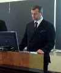
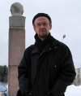
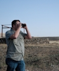

Individual Scholars
===================================

### Dragana Cvetanovic

Dragana Cvetanovic is a PhD Candidate at the Aleksanteri Institute. She is working on her theses on Serbian and Finnish rap-lyrics and identities. Her main fields of research are sociolinguistic and discourse analysis, but her academic interests concern even area studies of the Western Balkans (especially Serbia, Croatia and Bosnia and Hercegovina), recent history as well as contemporary political and social transformations of the region and popular culture studies. Her latest article examines syncronicity of history seen through the Serbian popular culture texts. 

**Keywords**: *Western Balkans, popular culture, language, literature, recent and contemporary history, rap, hip hop*

### Emma Hakala

Emma Hakala is a doctoral candidate working on a dissertation concerning the securitization of environment in the Western Balkans after the conflicts of the 1990’s. Her regional specialization is on the Balkans, with a particular focus on Serbia. Other research interests include environmental politics in post-socialist countries, new security theory, environmental cooperation, and sustainable development in post-conflict situations. Emma has previously worked in the Aleksanteri Institute's "Environment and Security in the Western Balkans" project and co-edited the book "Energy Security and Environment in the Western Balkans".

**Keywords:** *Western Balkans, environmental security, post-conflict cooperation, international organizations*

### Brendan Humphreys

Dr. Brendan Humphreys holds a PhD in Social Sciences (political history). His minor degree was in anthropology, and he brings a very broad social scientific perspective to his research. His research interests include; Balkan history, New Cold War history, international diplomacy and conflict escalation, myth construction, hagiography and civic religion, the politics of paranoia, the sociology of violence, and the dynamics of atrocity images and policy. He has lectured extensively on the history, politics and cultures of the Balkans. 

**Keywords:** *Myth, conflict, exceptionalism, victimhood* 

### Sigrid Kaasik-Krogerus

Sigrid Kaasik-Krogerus finishes her PhD thesis at the Aleksanteri institute, University of Helsinki where she works as a researcher. In her studies Kaasik-Krogerus has focused on national identity, Estonia and European Union. As a media researcher she is also familiar with the qualitative and quantitative media analysis. On the basis of the results of her research, Kaasik-Krogerus has also taught several courses in Helsinki, Tallinn and Tartu Universities dealing with the national identity, media, Estonian society and/or European Union.

**Keywords**: *national identity, Estonia, European Union, media studies, discourse analysis*

### Markus Kainu

Markus Kainu is a PhD Candidate at the Aleksanteri Institute. He is quantitatively orientated social scientist specialized in studying poverty and inequalities in post-socialist space from comparative perspective, and in open source research software carpentry. In particular, his research contributes to the discussion on post-socialist welfare regime, multidimensional poverty and spatial dimension of poverty and inequality in post-socialist transition. In addition to Eastern Europe, he also works on same issues on Russia. See website at: <http://markuskainu.fi/> for more information.

**Keywords**: *poverty, inequality, social policy, quantitative analysis, comparative research, open source research software*

### Katalin Miklossy

Dr Katalin Miklossy is Adjunct Professor (Docent) and Senior Researcher and at the Aleksanteri Institute. She is focusing on contemporary political history of East Central Europe with special interest in entrepreneurship, competition and East-West interaction. Miklossy has recently led the international research project “Competition in Socialist Society”. Her current works examine the varieties of socialism and post-communist hybrid systems. She is also a scholar in the Finnish Centre of Excellence in Russian Studies on the Choices of Russian Modernisation. Miklossy was elected as the founding member of the Teachers’ Academy at the University of Helsinki as recognition of excellence in teaching and pedagogical scholarship.

**Keywords**: *political development, nationalism, democratisation, market behaviour*

### Jouko Nikula

Senior Researcher Ph.D. Jouko Nikula has specialized in the transformation of class structure and the development of middle classes in post-socialist societies, especially the formation of class of private entrepreneurs. He has co-authored books on changing class structure in Russia and his latest book “Innovations and Entrepreneurs in Socialist and Post-Socialist Societies” (together with Ivan Tchkalov) was released in 2013 by the Cambridge Scholars Publishing. Currently his interests concern the role of trade-unions in post-socialist (industrial) work organization.

### Mila Oiva

MA Mila Oiva is researcher at the University of Turku (Cultural History) and Aleksanteri Institute. She focuses on cultural history of the socialist era in Poland and in the Soviet Union. The topic of her PhD research is marketing of Polish clothes in the Soviet Union after the World War II and opportunities and restrictions to economic activities of intermediate level organizations in socialist setting. She is also interested in digital humanities and especially on usage of digital methods in historical research. Oiva is scholar in the Finnish Centre of Excellence in Russian Studies on the Choices of Russian Modernisation. She is founder of KHdigilab at the Cultural History Unit, and member of DigiCoffee at the Aleksanteri Institute.  

**Keywords**: *Poland, action space, planning economy, consumer culture, marketing, clothing industry, digital humanities*

### Mikko Palonkorpi

Mikko Palonkorpi is a researcher at the Aleksanteri Institute and he is currently writing his doctoral dissertation on energy security issues in the South Caucasus for the Department of Political and Economic Studies, University of Helsinki. His main research interests are international relations theory as it pertains to aspects of energy security. He has specialized on the energy, foreign, security and domestic politics of the South Caucasus region. He has carried out extensive field research trips to the Caucasus region and published several articles on Caucasus related topics in papers, journals, reports and books.

**Keywords**: *securitization, energy security, South Caucasus, protracted conflicts*

### Heini Puurunen

Heini Puurunen (MA) is a PhD candidate at the Department of World Cultures and at the Aleksanteri Institute. She works currently in an EU research project “Rage – Hate Speech and Populist Othering in Europe”. Puurunen has been engaged in various Russian and Eastern Europe related projects concerning issues of welfare, transition, migration and gender. Regionally she is specialized in the Slavic Balkans, thematically in Roma minorities. Puurunen’s doctoral thesis examines the questions of minorities, boundaries and belonging in Bulgarian, Serbian and Macedonian border region.

**Keywords**: *Balkans, borders, Slavonic languages, minorities, Roma.*